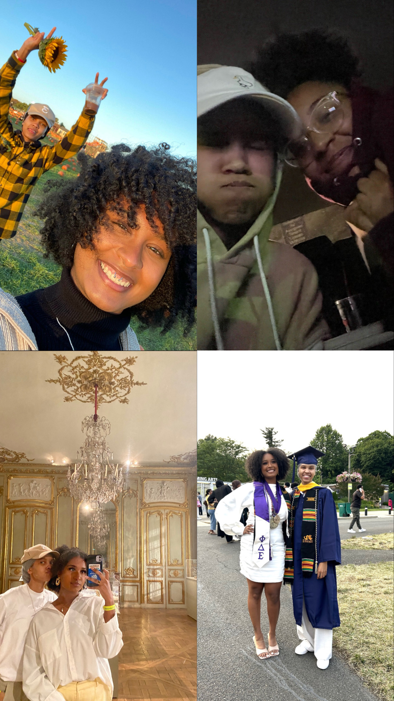

---
title:
output: 
  html_document:
    toc: true
    toc_float: true
    theme: journal
---

<link href="https://fonts.googleapis.com/css2?family=Dancing+Script&display=swap" rel="stylesheet">

  <h1 class="story-header">The Story of Us</h1>
  
Once upon a time, at a SOCPSY event at Cira Green, our paths crossed for the very first time. There she was, my Bebe, radiating beauty and charm, far beyond what I believed was within my reach. That brief encounter left an unforgettable mark on my heart, though our paths wouldn't cross again for a while.

  
  
As the leaves turned and the fall of my senior year unfolded, fate brought us together once more, this time in the shared space of a classroom (shoutout Dr. Morrison). Those ninety minutes became the highlight of my days, filled with anticipation and quiet joy. I still remember how you looked at me during my final presentation, and how nervous I got looking into those beautiful eyes. Our conversations began to blossom through texts and late-night talks, each message giving me butterflies – which was both delightful and ironic, given my fear of those little devil bugs.

  
  
Then, one day, you took a bold step and invited me on a date to a sunflower field. It was there, among all the yellow, that I saw you in a new light. You outshone all the sunflowers, with your hair dancing in the breeze, and your cute little smile everytime I said something dumb as we sat by the fire. Despite the cold that made me shiver, your presence warmed my heart, and I felt like the luckiest person alive.

  
  
Yet, life took us on separate paths, and for a while, we drifted apart. It was a time of regret and longing, a period I wished I could undo. But the heart knows its desires, and when our paths crossed again, I was determined not to let you slip away. You embodied everything I could ever wish for and more, a source of strength and kindness and intelligence and charm and vulnerability in my life.

  
  
When you forgave me, it felt like the world had righted itself. I vowed to stand by your side, to support you as you made your mark on the world. Those final weeks before graduation were a whirlwind of emotions and memories – late nights at your apartment, deep conversations in the car, a day spent wandering the museum, surprise visits to my job, and meeting your friends. Our first kiss felt like a touch of heaven, and each one since then has only felt better.

  
  
The night I asked you to be my girlfriend, cuddling in the warmth of my bed, your 'yes' was the sweetest sound. And later, in your New York apartment, when you asked me the same question, the joy was a thousand times greater. It's hard to believe that was a year ago, a year filled with love, adventures, and countless amazing memories. As we look to the future, my heart overflows with excitement for all the stories yet to be written, the adventures yet to be shared, and the love that continues to grow with each passing day. I am so glad that I get to be the Layl to your Kael. 

  
  

  

