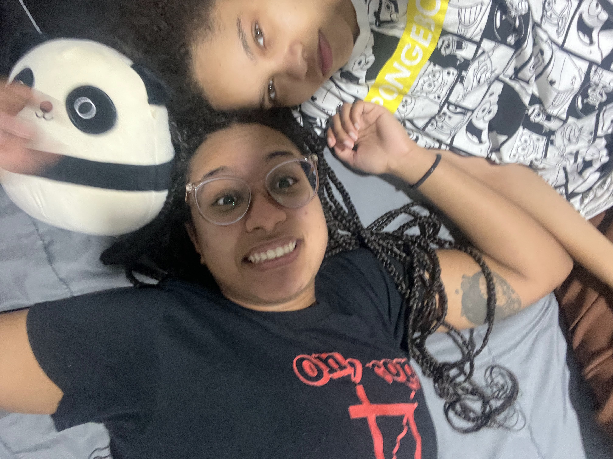

---
title:
output: 
  html_document:
    toc: true
    toc_float: true
    theme: journal
---

<link href="https://fonts.googleapis.com/css2?family=Dancing+Script&display=swap" rel="stylesheet">

  <h1>Wall of Kael & Layl</h1>
  
A collection of our cherished moments together

  
  
  
  
  
  
  
  
  
  
  
  
  
  
  
  
  
  
  
  
  
  
  
  
  
  
  
  
  
  
  
  
  
  
  
  
  
  
  
  
  
  
  
  
  
  
  
  
  
  
  
  
  
  
  
  
  
  
  
  

